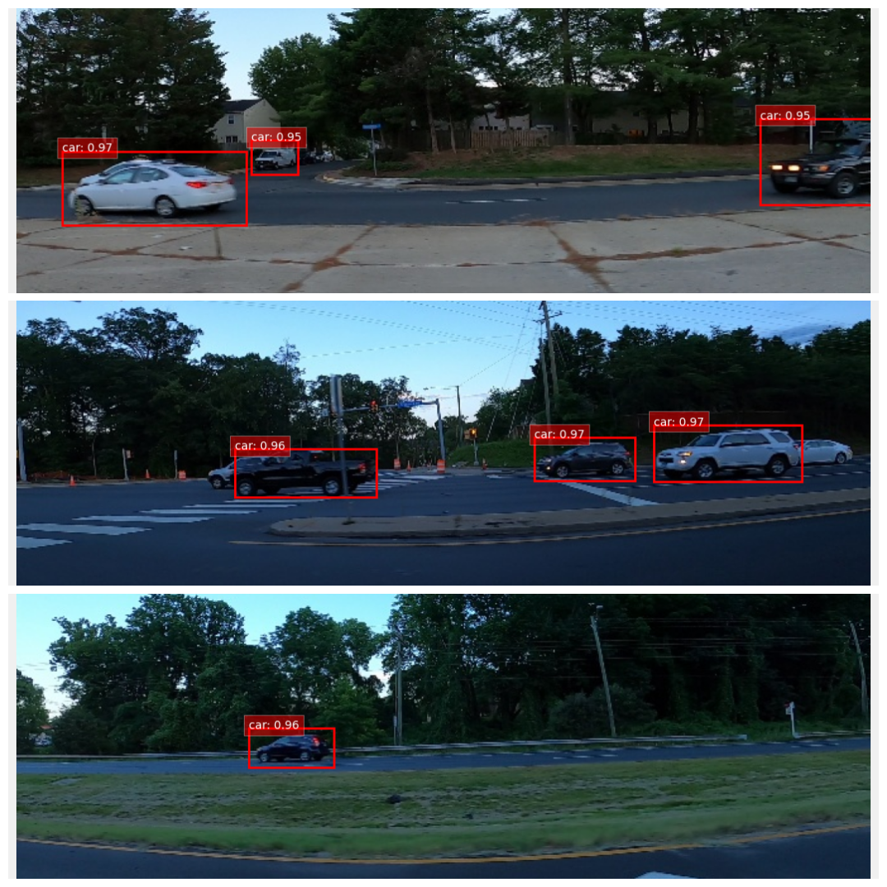
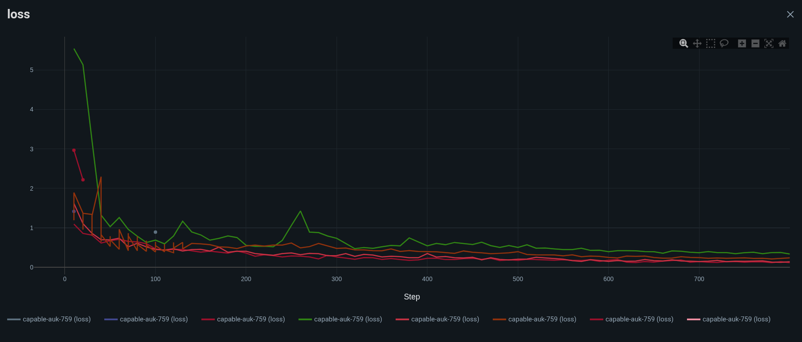

# Car Detection Project

## Features
- Data preprocessing for bounding box detection
- Object detection using state-of-the-art DETR model
- Training with configurable hyperparameters
- Inference on new images with visualization
- Bounding box visualization tools
- User-friendly CLI interface using Typer
- Model saving and loading with full configuration
- gradio GUI
# Model training 

